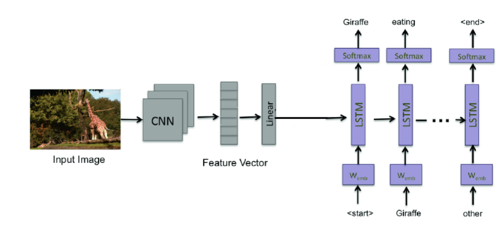
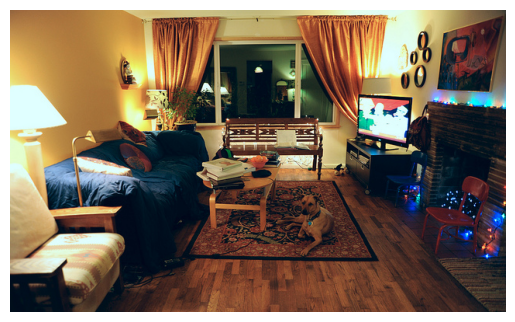
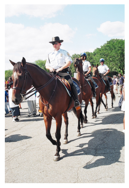

# Image Captioning Model

An end-to-end deep learning model for generating contextually relevant captions from images using **Inception v3** (CNN encoder) and **LSTM** (decoder) on the **MS COCO dataset**.

## Architecture



- **Encoder**: Inception v3 (pre-trained on ImageNet) extracts visual features from images
- **Decoder**: LSTM network generates coherent, descriptive captions from the visual features
- **Dataset**: MS COCO (Microsoft Common Objects in Context)

## Features

- Pre-trained Inception v3 encoder for robust feature extraction
- LSTM-based decoder for sequential caption generation
- Vocabulary building with frequency thresholding
- Custom data loading with padding and batching
- Training with validation and checkpointing
- Inference script for generating captions on new images

## Installation

1. Clone the repository and navigate to the project directory:
```bash
cd "Image-captioning-model"
```

2. Install required dependencies:
```bash
pip install -r requirements.txt
```

3. Download MS COCO dataset:
   - Training images: http://images.cocodataset.org/zips/train2017.zip
   - Validation images: http://images.cocodataset.org/zips/val2017.zip
   - Training annotations: http://images.cocodataset.org/annotations/annotations_trainval2017.zip

   Extract the files and organize them as:
   ```
   data/
   ├── train2017/
   │   └── [training images]
   ├── val2017/
   │   └── [validation images]
   └── annotations/
       ├── captions_train2017.json
       └── captions_val2017.json
   ```

## Usage

### Training

Train the model with default parameters:
```bash
python train.py \
    --train_dir data/train2017 \
    --train_annotations data/annotations/captions_train2017.json \
    --val_dir data/val2017 \
    --val_annotations data/annotations/captions_val2017.json \
    --batch_size 32 \
    --num_epochs 10 \
    --embed_size 256 \
    --hidden_size 512 \
    --learning_rate 0.001 \
    --save_dir ./checkpoints
```

**Arguments:**
- `--train_dir`: Directory containing training images
- `--train_annotations`: Path to training annotations JSON file
- `--val_dir`: Directory containing validation images
- `--val_annotations`: Path to validation annotations JSON file
- `--batch_size`: Batch size (default: 32)
- `--num_epochs`: Number of training epochs (default: 10)
- `--embed_size`: Embedding dimension (default: 256)
- `--hidden_size`: LSTM hidden state size (default: 512)
- `--num_layers`: Number of LSTM layers (default: 1)
- `--learning_rate`: Learning rate (default: 0.001)
- `--freq_threshold`: Minimum word frequency for vocabulary (default: 5)
- `--save_dir`: Directory to save checkpoints (default: ./checkpoints)
- `--resume`: Path to checkpoint to resume training from (optional)

### Inference

Generate captions for new images:
```bash
python inference.py \
    --checkpoint checkpoints/best_checkpoint.pth \
    --vocab checkpoints/vocab.pkl \
    --image path/to/your/image.jpg \
    --embed_size 256 \
    --hidden_size 512 \
    --max_length 20
```

**Arguments:**
- `--checkpoint`: Path to trained model checkpoint
- `--vocab`: Path to vocabulary pickle file
- `--image`: Path to input image
- `--embed_size`: Embedding size (must match training)
- `--hidden_size`: LSTM hidden size (must match training)
- `--num_layers`: Number of LSTM layers (must match training)
- `--max_length`: Maximum caption length (default: 20)

## Model Details

### Encoder (Inception v3)
- Pre-trained on ImageNet
- Extracts 2048-dimensional feature vectors
- Fine-tuned last few layers during training
- Projects features to embedding space (256-dim by default)

### Decoder (LSTM)
- Single-layer LSTM (configurable)
- Hidden state size: 512 (configurable)
- Word embeddings: 256 dimensions
- Generates captions word-by-word using greedy search

### Training Details
- Loss function: Cross-entropy (ignoring padding tokens)
- Optimizer: Adam
- Learning rate scheduling: ReduceLROnPlateau
- Gradient clipping: Max norm = 1.0
- Image preprocessing: Resize to 299x299, normalize with ImageNet statistics

## Output

- **Checkpoints**: Saved in `--save_dir` directory
  - `latest_checkpoint.pth`: Latest model checkpoint
  - `best_checkpoint.pth`: Best model based on validation loss
  - `vocab.pkl`: Vocabulary pickle file
- **TensorBoard logs**: Saved in `--save_dir/logs` for visualization

## Requirements

- Python 3.7+
- PyTorch 2.0+
- torchvision 0.15+
- pycocotools
- nltk
- numpy, pillow, tqdm, matplotlib

## Notes

- The model uses Inception v3's default input size (299x299)
- Vocabulary is built from training data with frequency thresholding
- Captions are tokenized using NLTK's word_tokenize
- Special tokens: `<PAD>`, `<START>`, `<END>`, `<UNK>`
- Training can be resumed from checkpoints using `--resume` flag

## Example

After training, you can generate captions like:
```bash
python inference.py \
    --checkpoint checkpoints/best_checkpoint.pth \
    --vocab checkpoints/vocab.pkl \
    --image example.jpg
```

Output:


```
Generated Caption: living room with couch and television
```


```
Generated Caption: woman is playing tennis on court
```


```
Generated Caption: man riding horse down the road
```

